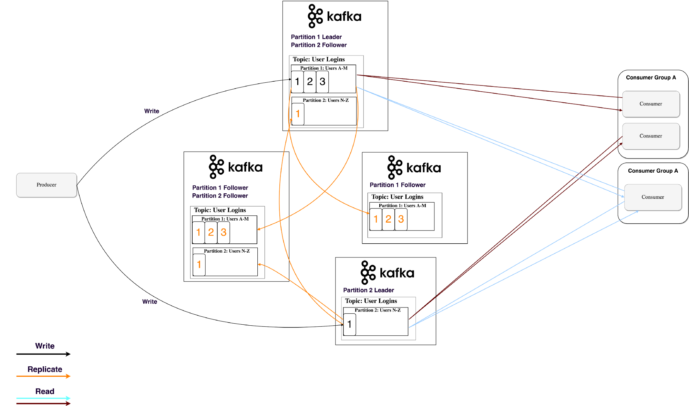

1
![1-horizontal-scale][1-horizontal-scale]
水平扩展在某个阈值后变得更便宜

[1-horizontal-scale]: https://github.com/shadowlan/blog/tree/master/images/distribution-system/kafka/1-horizontal-scale.png

2

水平扩展在某个阈值后变得更便宜

3. 
![1-horizontal-scale][1-horizontal-scale]
水平扩展在某个阈值后变得更便宜

[1-horizontal-scale]: ../../images/distribution-system/kafka/1-horizontal-scale.png

4. 

_水平扩展在某个阈值后变得更便宜_
5

6

