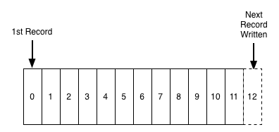
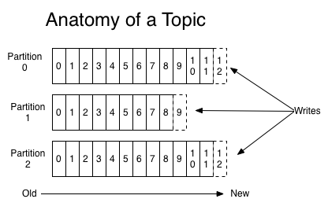
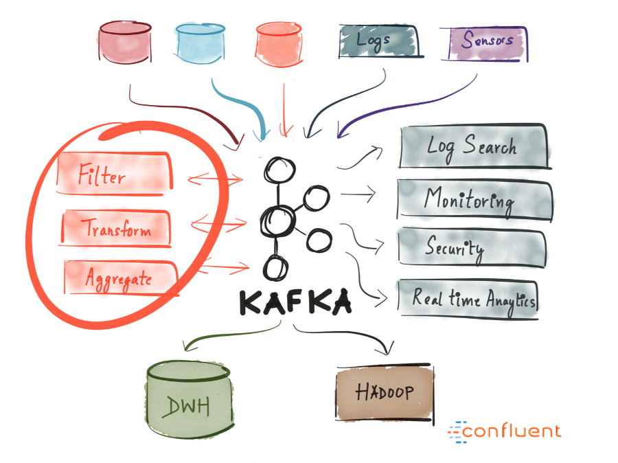

# Apache Kafka详细介绍

本文翻译自[Thorough Introduction to Apache Kafka](https://hackernoon.com/thorough-introduction-to-apache-kafka-6fbf2989bbc1)

有些技术词汇在中文并没有合适的翻译，为了避免歧义，在一些中文词汇后用[original words]提供英文原词帮助理解。

## 介绍

Kafka是一个现今经常听到的词，许多业界领先的IT公司也会用它，但它到底是什么呢？

Kafka最早由LinkIn公司于2011年开发，并从哪之后有了很多改进，如今它是一整套平台，允许你能够冗余地存储超乎寻常的数据量，有一个高吞吐量（每秒百万级）的消息总线，并能一次性对所有通过它的数据进行实时的流处理。

这些都很好很棒，但是抛开这些去看它的本质，Kafka就是一个分布式，可水平扩展的，容错的提交日志[commit log]。

其中有很多引人注目的词汇，让我们一一审视，看看他们是什么意思，毕竟，我们将要深入到它是如何工作的。

### 分布式

分布式系统是指能够拆分到多个机器运行，所有机器在一个集群中一起工作的系统，而从终端用户看起来就像一个节点。Kafka因其在不同节点(称之为代理[broker]）上存储和收发消息而被视为分布式系统。

这个方式的好处是具有高可扩展性和容错性。

### 水平扩展能力

先让我们定义何为垂直扩展能力，假设，你有一个传统的数据库服务器开始超负荷运行，要解决这个问题的方式可以是简单的增加这台服务器的资源（CPU,RAM,SSD）。这种通过给机器增加更多资源的方式称之为**垂直扩展**。而向上扩展的两个主要缺点是：
  * 硬件资源是有限的，你不可能无限扩展
  * 通常需要停机，这对某些大公司来说是无法承受的。

**水平扩展**是通过加入更多的机器来解决同样的问题。加一个新机器不会引发停机，也不会对集群中的机器数量做任何限制。要明白不是所有的系统都支持水平扩展，因为他们没有被设计成在集群中工作，而那些系统通常用起来都更复杂。

_水平扩展的成本在某个阈值后变得更便宜_

### 容错

非分布式系统里的潜在问题是会出现单点故障，如果你的单个数据库服务器失效（机器常会这样...）,不管是何种方式，你都完蛋了。。。

分布式系统设计成以可配置的方式来适应失效。在一个有5个节点的Kafka集群中，你能够在两个节点都宕机的情况下继续工作。值得留意的是容错是以牺牲性能为直接代价的，当你的系统容错性越强，你的性能就越会下降。

### 提交日志[Commit Log]

一个提交日志（也被称为预写日志[write-ahead log]，交易日志[transaction log]）是一个持久的有序的数据结构，只支持追加写入，你不可能从中修改或者删除记录。而它通过从左到右的读取来保证条目的顺序。

_提交日志的示例图，来自[这里](https://engineering.linkedin.com/distributed-systems/log-what-every-software-engineer-should-know-about-real-time-datas-unifying)_

-你是在告诉我Kafka是如此简单的数据结构嘛？

在很多方面，是的，这个结构是Kafka的核心，也是无价的，因为它提供了次序，因此提供了确定的数据处理过程。这两方面在分布式系统中都不是个小问题。

Kafka实际上存储所有的消息到磁盘（稍后详述），并且有序地排列在结构中，这样它能够充分利用顺序读写磁盘的优势。

  * 读和写是常量时间O(1)(知道记录的ID)，这和其他结构为O(log N)的磁盘操作相比是个巨大的优势，因为每次磁盘寻道都是耗时的。
  * 读和写不相互影响。写入不会锁住读取，反之亦然（和平衡树相反）

这两点有巨大的性能优势，因为数据的大小就和性能完全解耦.Kafka无论你的服务器有100KB或者100TB的数据情况下都有同样的性能。

## 它如何工作的？

应用（生产者[**producers**]）发送消息（记录[**records**]）给Kafka节点（代理[**broker**]），并且上述消息被其他称之为消费者[**consumers**]的应用所处理。上述消息被存储在一个主题（**topic**）中，而消费者通过订阅主题来接收新消息。

因为主题会变得相当大，他们会被拆分到多个更小尺寸的分区[**partitions**]中以得到更好的性能和扩展性。（例如：假设你要存储用户登陆请求，你可以按照用户名称的第一个字母来拆分他们）

Kafka确保在一个分区内的所有消息都是按照他们进入的顺序排列的。你区分一个特定消息的方法是通过它的偏移量[**offset**],你可以把它看作一个常见的数据索引，在一个分区内随着每个新消息进入而增长的序列号。

Kafka遵循的原则是傻瓜代理[a dumb broker]和聪明消费者[smart consumer]，这意味着Kafka并不跟踪哪些记录被消费者读取并删除它们，而是将它们存储一段时间（例如一天）或者直到达到一个存储空间阀值。消费者本身从Kafka获得新消息，并告之他们想要读取那条记录，这允许他们任意增加或减少偏移量，因此能够重现和重新处理事件。

值得注意的是，消费者们实际上是一个消费组[consumer groups],内部拥有一个或者多个消费者进程。为了避免两个进程重复读取相同的消息，每个分区在每个组中仅和一个消费者进程绑定。

_数据流展示_

## 持久化到磁盘

如我前面提到的，Kafka实际上将所有记录存储到磁盘，不会保留任何内容在内存中。你可能会疑问如此轻慢的方式怎么会是一个明智的选择？实际上在这背后的大量优化使之成为可能：

  * Kafka有协议将消息组织在一起。这允许网络请求将消息组织到一起从而减少网络开支，而服务器一次持久化大块的消息，同时消费者可以一次性获得大的线性数据。
  * 线性读取和写入磁盘都很快。关于现代磁盘很慢的观念实际是因为磁盘寻道。而这在大量线性操作中并不是一个问题。
  * 前述的线性操作在OS中通过预读[read-ahead]（提前获取大块的数据）和后写[write-behind]  (将小的逻辑写合并为一次大的物理写操作)技术而得到大量的优化。
  * 现代操作系统会将磁盘内容缓存到空闲内存中。这称之为页面缓存
  * 因为Kafka在整个流(生产者->代理->消费者)中以未更改的标准二进制格式存储消息，它能够利用零拷贝[zero-copy]优化方式。这种方式意味着OS从页面缓存直接拷贝到套接字[socket],从而有效地完全绕开Kafka代理应用。

所有这些优化使得Kafka能够以近乎网络速度来传送消息。

## 数据分发和复制

我们再来说说Kafka如何实现容错以及它如何在节点间分发数据。

### 数据复制 

分区数据在多个代理间进行复制来保存数据，从而避免某个代理挂掉的情况。

任何时刻，一个代理“拥有”一个分区，并且是应用自始自终从那个节点读写分区。这称之为分区主导者[**a partition leader**].它将收到的数据复制到其他N个称之为跟随者[**followers**]的代理，他们也存储数据，并且准备好在主节点挂掉的情况下被选举为主节点。

这帮助你配置以保证任何成功发布的消息不会被丢失掉，并可根据数据的紧要性，有选项来更改复制因子从而能够通过牺牲性能来获得更好的持久性保证。

_具有三个复制因子的四台Kafka代理_

在这样的方式下，如果主节点永远失效，某个跟随者将能够替代他的位置。

但是，你可能会问：
- 生产者／消费者如何知道谁是分区主节点？

生产者／消费者为了从一个分区写／读数据，他们需要知道谁是分区主导者，对吗？这个信息需要从某个地方得到，而Kafka将这样的元数据存储在**Zookeeper**服务上。

### 什么是Zookeeper

Zookeeper是一个分布式的键值存储。它对读高度优化，但是写相对慢。常被用于存储元数据和处理集群机制（心跳检测，分布式更新／配置等）

它允许服务客户端（Kafka代理）订阅，并在变更发生时将修改发送给它。这就是代理如何知道什么时候切换分区主节点。Zookeeper也同样具有很好的容错能力，而且它也必须如此，毕竟Kafka重度依赖它。

它被用来存储各种元数据，这里列举一些：
  * 每个分区的消费者组的偏移量 (虽然现代客户端会在每个独立的Kafka主题里存储偏移量)
  * ACL（访问控制列表）-用来限制访问和认证
  * 生产者和消费者配额-消息最大值／安全边界
  * 分区主节点和他们的健康信息

### 一个生产者／消费者如何知道谁是分区主节点？

生产者和消费者曾经直接和Zookeeper连接并通信来获得这个(以及其他的)信息.Kafka已经分别从0.8和0.9版本将这个耦合移除，客户端从Kafka代理直接获得元数据信息，而代理本身将和Zookeeper通信。

_元数据流_

## 流

在Kafka中，流处理器是从输入主题中获得持续流数据，基于这些数据执行某些处理并产生一个数据流到输出主题（或者外部服务，数据库，垃圾桶等任何地方）

用生产者／消费者API也可以直接做简单的处理，但是对于更复杂的转换例如将流连接起来，Kafka提供一个集成的流API库。

这个API目的是用于你自己的代码库，并不在代理上运行。它和消费者API类似，帮助你在多个应用上进行流处理工作的扩展（类似消费组）

### 无状态处理

流的无状态处理是指不依赖任何外部的确定的处理过程。对于给定任何的数据，你确定结果都将独立于其他任何事物而产生同样的输出。例如一个简单的数据转换： 在字符串“Hello”后面追加一些内容，比如“Hello,World!”

### 流-表[stream-table]二元性[duality]

很重要的一点是，必须认识到流和表本质上是一样的，流能够被转译成表，而表也能转换成流。

### 流作为表

如果你有留意到数据库的同步复制是如何实现的，就会发现它实际通过所谓的**流复制**，表里的每个变更都会被发送给一个副本机器。Kafka流也可以同样的方式诠释，作为数据更新的流，聚合的最终结果是一个表，这个流被保存到一个本地RocksDB(默认方式),称之为**KTable**。

_每个记录增加聚合的数量_

### 表作为流

一个表可以被视为流里每个健的最新值的快照。同样的方式，流记录可以产生表。表更新可以产生一个变更日志流。

_每个更新在流中产生一个快照记录_

### 有状态处理

有些简单操作如map() 或者filter() 是无状态的，处理过程不要求你保留任何数据。但是，在真实世界，你的大部分操作都是有状态的（比如count()），这要求你保存当前累积的状态。

在流处理中维护状态带来的问题是流处理会失败！然而，为了容错能力，你需要保留这个状态吗？

一个不成熟的做法是简单地将所有的状态存储到一个远程数据库，通过网络连接到这个仓库。问题是这没有数据本地化（locality of data），并且引入大量的网络往返时延，这两点将会显著拖慢你的应用。一个很小但很重要的问题是，你的流处理任务的正常运行时间将和远端数据库紧耦合，而这个任务将无法自给自足（一个从其他team引入的数据库变更就可能打断你的处理过程）

那什么是更好的方法？

回忆下表和流的二元性，这让我们能够将流转换成表，并与我们的处理过程同地协作，同时也通过将流存储到Kafka代理里而为处理容错提供了一种机制。

流处理器能够将它的状态保存到一个本地表（例如RocksDB），这个表会被输入流更新（可能经过某些强制转换）。当流处理进程挂掉，它可以通过重现流来恢复数据。

你甚至能够让一个远程数据库成为流的生产者，在你本地重建表时有效地广播一个变更日志。

### KSQL

通常，你可能被迫要用一种JVM语言来写你的流处理过程，因为Kafka官方唯一的流API客户端。

_KSQL创建示例_

目前，开发者预览版**KSQL**提供一个新的特色，允许你用类SQL的语言来写简单的流任务。

你通过创建一个KSQL服务器，并通过命令行交互查询来管理处理进程。它具有同样的抽象（KStream和Ktable），保证和流API一样的优势（可扩展性，容错性），并大大简化流处理的工作。

这听起来可能没什么，但是从实践角度看，这是一个测试相关内容的很有用的方式，甚至允许开发之外的人（例如产品专员[product owner]）来用一用流处理。我推荐你看看[入门视频](https://www.youtube.com/watch?v=A45uRzJiv7I&t=2m13s)，会发现它是如此简单。

### 流处理的其他选择

Kafka Streams完美结合了功能和易用性，它在市场上针对流任务拥有无可争议的最好的性能，跟Kafka的集成也远比其他流处理方案要好（Storm,Samza,Spark,Wallaroo）.

多数其他流处理框架的问题是他们部署和用起来都很复杂，例如Spark这种批量处理框架需要：
  * 在很多机器间控制大量的任务，并需要在集群中有效的分发他们。
  * 为了实现上述这点，需要动态将你的代码打包并实际部署到需要执行他们的节点上去（并伴随着配置，库等等。。。）

不幸的是应付这些问题使得这些框架相当烦扰，他们想控制代码如何部署，配置，监控和打包的各个方面。

Kafka Streams让你在需要的时候推出你自己的部署策略，无论是Kubernetes，Mesos，Nomad，Docker Swarm或者其他的。

Kafka Stream底层的动机是让你所有的应用都能够做流处理，而不需要考虑运行和维护其他集群的运营复杂度。其唯一的潜在缺点是它和Kafka紧耦合，但在实际情况下如果大多数实时处理都是由Kafka提供，那么这将不是一个大问题。

# 什么时候用Kafka

如前面我们以及提到的，Kafka允许你有大量的消息通过一个中心化媒介并保存它们，而不需要担心像性能损耗和数据丢失。

这意味着它很适合成为你系统架构的中心，作为核心媒介来和不同的应用连接。Kafka能够作为一个事件驱动架构的核心部分，让你真正地将不同应用解耦。

Kafka使你能够轻松地将不同（微）服务之间的通信解耦。通过Streams API，现在比以往更容易写业务逻辑,这为服务间消费丰富了Kafka主题数据。这里有无限可能性，我鼓励你去探索一下其他公司是怎么使用Kafka的。

# 总结

Apache Kafka是一个拥有一天处理万亿事件能力的分布式流平台。Kafka提供了低延迟，高吞吐，容错发布和订阅流水线[subscribe pipeline],也能够处理事件流。

我们过了一遍它的基本概念（生产者，代理，消费者，主题），学习了它的一些优化方式（页缓存），也了解了它如何通过数据复制来容错，以及它强大的流处理能力。

Kafka在全世界范围内已经被上千公司大量采用，涵盖三分之一的财富500强企业。随着Kafka的持续改进和近期发布的1.0主版本（2017年12月1日），可以预见这个流平台将和关系型数据库一样将成为一个大的，主要的数据平台。

我希望这个介绍帮助你熟悉Apache Kafka和它的潜能。

# 阅读资源和我未提及的东东

还有很多的内容本篇文章无法一一涵盖，这里列出一些我并未提到但是值得去了解的功能：

  * [Connector API](https://www.confluent.io/blog/announcing-kafka-connect-building-large-scale-low-latency-data-pipelines/) - API帮助你将多种服务作为源或者接收端连接到Kafka（PostgreSQL, Redis, ElasticSearch）
  * [Log Compaction](http://cloudurable.com/blog/kafka-architecture-log-compaction/index.html) - 用于减少日志规模的优化. 在变更日志流中非常有用
  * [Exactly-once Message Semantics](https://www.confluent.io/blog/exactly-once-semantics-are-possible-heres-how-apache-kafka-does-it/) - 保证消息只被接受一次，这是很重要的。

## 资源

* [Confluent Blog](https://www.confluent.io/blog/) - 很多Apache Kafka相关的信息
* [Kafka Documentation](https://kafka.apache.org/documentation/) - 大量高质量文档
* [Kafka Summit 2017 videos](https://www.confluent.io/kafka-summit-sf17/resource/)
 
感谢你花时间阅读这篇文章！
